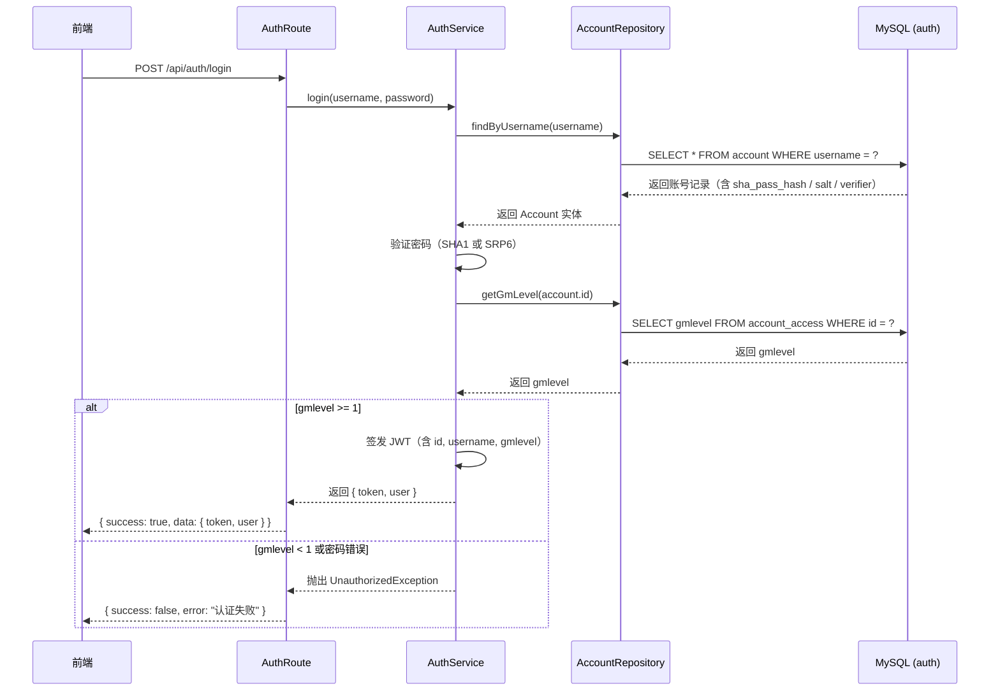
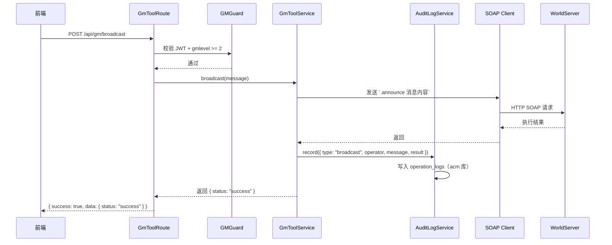
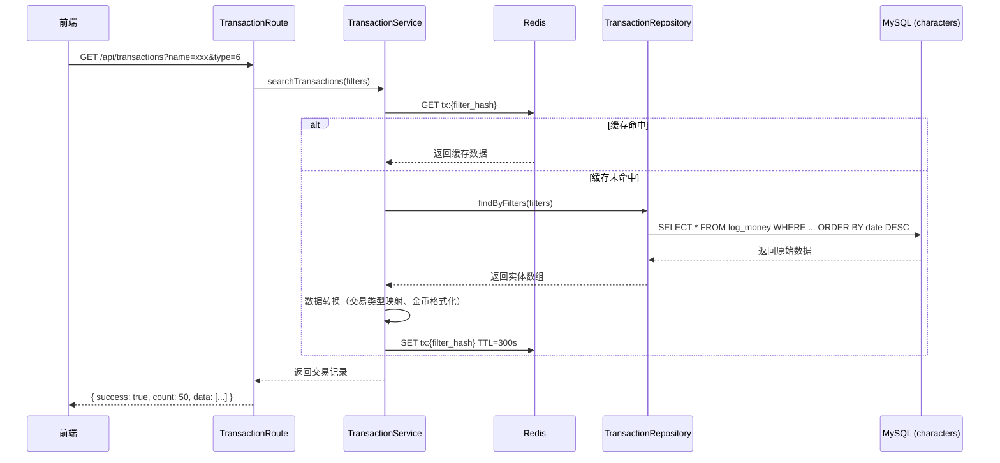
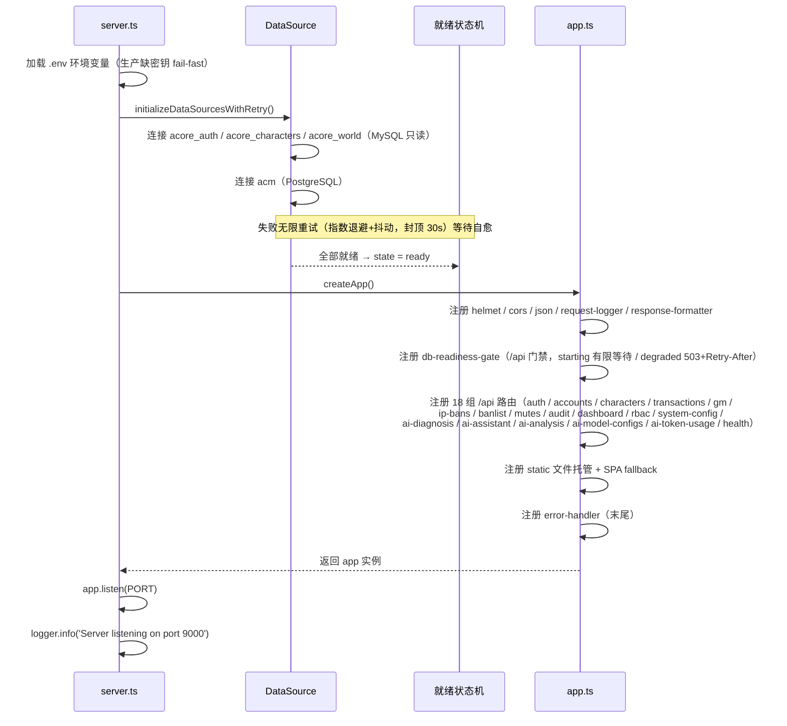

# acore-manager 后端架构设计

## 一、后端技术栈

| 技术栈 | 版本 | 说明 |
|-------|------|------|
| **Node.js** | >= 22.0.0 | 运行环境（deepagents 传递依赖 openai@7 要求 node>=22） |
| **Express** | ^4.21.0 | 轻量 Web 框架 |
| **TypeScript** | ^5.6.2 | 类型安全 |
| **TypeORM** | ^0.3.20 | ORM，多数据源（auth/characters/world 只读 + acm 可写） |
| **pg** | ^8.23.0 | PostgreSQL 驱动（acm 自有库） |
| **ioredis** | ^5.4.1 | Redis 客户端 |
| **pino** | ^9.4.0 | 高性能结构化日志 |
| **pino-pretty** | ^11.2.2 | 开发环境日志美化 |
| **helmet** | ^7.1.0 | HTTP 安全头 |
| **cors** | ^2.8.5 | CORS 跨域中间件 |
| **express-validator** | ^7.2.0 | 请求参数校验 |
| **jsonwebtoken** | ^9.0.0 | JWT 签发与验证 |
| **bcryptjs** | ^2.4.3 | SHA1 密码校验辅助 |
| **deepagents** | ^1.14.0 | AI Agent 运行时（巡检诊断，见 06 文档） |

---

## 二、后端目录结构

### 2.1 完整目录组织

```
backend/
├── src/
│   ├── app.ts                      # Express 应用配置（中间件、路由注册）
│   ├── server.ts                   # 服务器启动入口
│   │
│   ├── config/                     # 配置模块
│   │   ├── database.ts             # 多数据源连接（3×MySQL 只读 + 1×PostgreSQL）与就绪状态机
│   │   ├── env.ts                  # 环境变量校验与加载（生产 fail-fast）
│   │   ├── load-env.ts             # .env 加载
│   │   ├── redis.ts                # Redis 连接配置
│   │   ├── mail-template.ts        # 邮件模板
│   │   └── system-config.reader.ts # acm_system_config 读取（DB 值优先）
│   │
│   ├── middleware/                 # Express 中间件
│   │   ├── auth.ts                 # JWT 鉴权中间件
│   │   ├── gm-guard.ts             # GM 等级权限校验中间件
│   │   ├── db-readiness-gate.ts    # /api 数据库就绪门禁（503 + Retry-After）
│   │   ├── error-handler.ts        # 全局异常处理中间件
│   │   ├── request-logger.ts       # 请求日志中间件（pino）
│   │   └── response-formatter.ts   # 统一响应格式化中间件
│   │
│   ├── entities/                   # TypeORM 实体（按数据库命名空间分目录）
│   │   ├── auth/                   # acore_auth（只读）
│   │   │   ├── account.entity.ts
│   │   │   ├── account-access.entity.ts
│   │   │   ├── account-banned.entity.ts
│   │   │   └── ip-banned.entity.ts
│   │   ├── characters/             # acore_characters（只读）
│   │   │   ├── characters.entity.ts
│   │   │   ├── character-inventory.entity.ts
│   │   │   ├── item-instance.entity.ts
│   │   │   ├── character-skills.entity.ts
│   │   │   ├── character-queststatus.entity.ts
│   │   │   ├── character-reputation.entity.ts
│   │   │   ├── arena-team.entity.ts
│   │   │   ├── arena-team-member.entity.ts
│   │   │   ├── log-money.entity.ts
│   │   │   ├── mail.entity.ts
│   │   │   ├── mail-items.entity.ts
│   │   │   └── auctionhouse.entity.ts
│   │   ├── world/                  # acore_world（只读）
│   │   │   ├── item-template.entity.ts
│   │   │   └── creature-template.entity.ts
│   │   └── acm/                    # acm 自有库（PostgreSQL，可写）
│   │       ├── ai-model-config.entity.ts        # LLM 模型配置
│   │       ├── ai-chat-session.entity.ts        # AI 会话
│   │       ├── ai-chat-message.entity.ts        # 会话消息
│   │       ├── ai-report.entity.ts              # 巡检报告
│   │       ├── ai-targeted-analysis.entity.ts   # 定向分析
│   │       ├── ai-token-usage.entity.ts         # token 用量
│   │       ├── ai-anticheat-exemption.entity.ts # 误报豁免白名单
│   │       ├── ai-tool-audit.entity.ts          # Agent 工具调用审计
│   │       ├── operation-log.entity.ts          # GM 操作审计
│   │       └── system-config.entity.ts          # 系统配置（DB 值优先）
│   │
│   ├── repositories/               # 数据访问层（SELECT-only，见数据库操作规范）
│   │   ├── base.repository.ts      # 基础仓储（封装通用查询）
│   │   ├── account.repository.ts   # 账号相关查询
│   │   ├── character.repository.ts # 角色相关查询
│   │   ├── transaction.repository.ts # 交易记录查询
│   │   ├── audit-log.repository.ts # 审计日志查询
│   │   ├── banlist.repository.ts   # 封号列表查询
│   │   ├── dashboard.repository.ts # 仪表盘统计查询
│   │   ├── ip-ban.repository.ts    # IP 封禁查询
│   │   ├── mute.repository.ts      # 禁言查询
│   │   └── rbac.repository.ts      # RBAC 权限查询
│   │
│   ├── services/                   # 业务逻辑层（核心业务实现）
│   │   ├── auth.service.ts         # 认证与 JWT
│   │   ├── account.service.ts      # 账号管理
│   │   ├── character.service.ts    # 角色管理
│   │   ├── transaction.service.ts  # 交易记录
│   │   ├── gm-tool.service.ts      # GM 工具
│   │   ├── soap.service.ts         # SOAP 命令执行封装
│   │   ├── banlist.service.ts      # 封号列表
│   │   ├── mute.service.ts         # 禁言管理
│   │   ├── ip-ban.service.ts       # IP 封禁
│   │   ├── rbac.service.ts         # RBAC 权限（含热加载）
│   │   ├── dashboard.service.ts    # 仪表盘统计
│   │   ├── audit-log.service.ts    # 审计日志
│   │   ├── brute-force.service.ts  # 登录爆破防护
│   │   ├── captcha.service.ts      # 验证码
│   │   ├── job-trigger.service.ts  # SCF 异步触发巡检 Job
│   │   ├── system-config.service.ts # 系统配置（五配置组）
│   │   ├── cache.service.ts        # Redis 缓存封装
│   │   └── ai/                     # AI 域（诊断/助手/定向分析/LLM 配置）
│   │       ├── inspection.service.ts      # 巡检编排
│   │       ├── inspection-prompt.ts       # 巡检任务提示词构建
│   │       ├── inspection-persist.ts      # 巡检结果落库/归档/通知
│   │       ├── report.service.ts          # 报告读写
│   │       ├── targeted-analysis.service.ts    # 定向分析编排
│   │       ├── targeted-analysis.conclusion.ts # 结论解析/校验契约
│   │       ├── chat.service.ts            # AI 助手对话轮次
│   │       ├── chat-session.service.ts    # 会话管理
│   │       ├── llm-config.service.ts      # 模型配置（api_key 加解密）
│   │       ├── token-usage.service.ts     # token 用量统计
│   │       ├── anticheat-exemption.service.ts # 误报豁免白名单
│   │       ├── feishu-notify.service.ts   # 飞书通知
│   │       └── agent-round.util.ts        # Agent 单轮流消费共享工具
│   │
│   ├── agent/                      # AI Agent 运行时机制（与业务编排分离；禁止 import services/）
│   │   ├── core/                   # prompt-loader.ts
│   │   ├── runtime/                # agent-factory / model-factory / wire / budget-guard / checkpointer
│   │   ├── tools/                  # registry + db-tools / log-tools / report-tools / ask-user / time-tool / false-positive
│   │   ├── prompts/                # inspection.yaml / analysis.yaml / assistant.yaml
│   │   └── skills/                 # log-search
│   │
│   ├── job/                        # 巡检 Job 独立入口（独立镜像，SCF 异步触发）
│   │   ├── job-entry.ts
│   │   └── tasks/                  # registry.ts + inspection-task.ts
│   │
│   ├── routes/                     # 路由层（薄路由，仅 HTTP 处理；AI 域扁平 ai-*.routes.ts）
│   │   ├── auth.routes.ts          # 认证
│   │   ├── account.routes.ts       # 账号管理
│   │   ├── character.routes.ts     # 角色管理
│   │   ├── transaction.routes.ts   # 交易记录
│   │   ├── gm-tool.routes.ts       # GM 工具
│   │   ├── audit-log.routes.ts     # 审计日志
│   │   ├── banlist.routes.ts       # 封号列表
│   │   ├── dashboard.routes.ts     # 仪表盘
│   │   ├── ip-ban.routes.ts        # IP 封禁
│   │   ├── mute.routes.ts          # 禁言管理
│   │   ├── rbac.routes.ts          # RBAC 权限
│   │   ├── system-config.routes.ts # 系统配置
│   │   ├── health.routes.ts        # 健康检查
│   │   ├── ai-diagnosis.routes.ts  # AI 诊断（报告/可疑玩家/豁免）
│   │   ├── ai-assistant.routes.ts  # AI 助手（SSE 会话）
│   │   ├── ai-analysis.routes.ts   # AI 定向分析
│   │   ├── ai-model-config.routes.ts # 模型配置
│   │   └── ai-token-usage.routes.ts  # token 用量
│   │
│   ├── shared/                     # 共享工具
│   │   ├── enums/                  # gm-level / race / class / transaction-type
│   │   ├── errors/                 # service-error.ts（统一业务异常）
│   │   ├── utils/                  # password / jwt / gold / faction / aes 等
│   │   └── async-handler.ts        # async 路由包装
│   │
│   └── types/                      # TypeScript 类型定义
│       └── express.d.ts
│
├── test/                           # 测试目录
│   ├── unit/                       # 单元测试（Services / Repositories / Utils）
│   └── e2e/                        # E2E 测试（API 路由端到端，supertest）
│
├── poc/                            # 实验代码（不进构建，禁止被 src/ 引用）
├── .env                            # 环境变量（开发）
├── .env.example                    # 环境变量模板
├── package.json                    # 项目依赖
└── tsconfig.json                   # TypeScript 配置（@/ 别名 → src/）
```

### 2.2 目录说明

| 目录 | 用途 | 规范 |
|------|------|------|
| `src/config/` | 配置模块 | 环境变量加载与校验、多数据源连接、就绪状态机 |
| `src/middleware/` | Express 中间件 | 按职责单一原则，每个中间件只做一件事 |
| `src/entities/` | TypeORM 实体 | 按数据库命名空间分目录（auth/characters/world 只读 + acm 可写） |
| `src/repositories/` | 数据访问层 | 封装 TypeORM 查询，**SELECT-only**，写操作走 SOAP |
| `src/services/` | 业务逻辑层 | **核心业务逻辑实现**，所有计算、缓存、事务、SOAP 调用在此 |
| `src/services/ai/` | AI 业务域 | 巡检/助手/定向分析编排与落库；Agent 机制一律下沉 agent/ |
| `src/agent/` | Agent 运行时 | 纯机制层（runtime/tools/prompts/skills），**禁止 import services/** |
| `src/job/` | 巡检 Job | 独立入口独立镜像，SCF 控制面异步触发 |
| `src/routes/` | HTTP 路由层 | 薄路由，仅处理参数校验和响应调用 |
| `src/shared/` | 共享工具 | 跨模块复用的 enums/errors/utils |
| `test/unit/` | 单元测试 | 与 src 目录结构对应 |
| `test/e2e/` | E2E 测试 | API 路由端到端测试，使用 supertest 模拟 HTTP 请求 |

---

## 三、架构设计原则

### 3.1 薄路由 + 厚服务分层架构

```
┌─────────────────────────────────────────────────────────────┐
│                     Routes 层（薄）                           │
│  职责：HTTP 请求处理、参数校验、调用 Service、返回响应         │
│  禁止：业务逻辑、数据库操作、缓存控制、SOAP 调用               │
└─────────────────────────────────────────────────────────────┘
                              │
                              ▼
┌─────────────────────────────────────────────────────────────┐
│                    Services 层（厚）                          │
│  职责：业务逻辑实现、数据计算、缓存读写、事务协调、SOAP 命令   │
│  特点：可独立测试，不依赖 HTTP 框架                           │
└─────────────────────────────────────────────────────────────┘
                              │
                              ▼
┌─────────────────────────────────────────────────────────────┐
│                   Repositories 层                            │
│  职责：数据库查询封装（SELECT-only）、SQL 查询构建            │
└─────────────────────────────────────────────────────────────┘
                              │
                              ▼
┌─────────────────────────────────────────────────────────────┐
│                     Entities 层                              │
│  职责：TypeORM 实体定义，映射 AzerothCore / acm 数据库 Schema │
└─────────────────────────────────────────────────────────────┘
```

### 3.2 各层职责定义

**Routes 层 — 只做 HTTP 处理**

| 允许 | 禁止 |
|------|------|
| 请求参数校验（express-validator） | 业务逻辑计算 |
| 调用 service 方法 | 数据库查询 |
| 设置 HTTP 状态码 | 缓存操作 |
| 异常捕获与转换 | 直接访问实体 |
| 附加审计日志信息 | SOAP 命令执行 |

**Services 层 — 核心业务逻辑**

| 职责 | 说明 |
|------|------|
| 业务逻辑实现 | 账号管理、角色查询、交易记录聚合 |
| 数据访问协调 | 调用 Repository 组合多个数据源 |
| 缓存控制 | 缓存读写和失效策略 |
| SOAP 命令执行 | GM 工具通过 SOAP/RA 发送命令 |
| 审计日志记录 | 敏感操作记录到 acm 库 operation_logs |
| 异常处理 | 业务异常（ServiceError）的定义和抛出 |

---

## 四、API 端点列表

> 以下为 18 组路由中的核心端点；AI 域（`/api/ai/*` 5 组）详见 [06AI诊断与Agent架构.md](./06AI诊断与Agent架构.md)。

### 4.1 认证模块

| 端点 | 方法 | 说明 | 认证 |
|-----|------|------|:----:|
| `/api/auth/login` | POST | 登录（验证 SHA1/SRP6 + 签发 JWT，支持验证码） | - |
| `/api/auth/me` | GET | 获取当前登录用户信息 | ✅ |
| `/api/auth/change-password` | POST | 修改当前用户密码 | ✅ |

### 4.2 账号管理模块

| 端点 | 方法 | 说明 | 认证 | 最低 GM |
|-----|------|------|:----:|:-------:|
| `/api/accounts` | GET | 账号列表（分页 + 搜索 + 排序 + 时间筛选） | ✅ | 3 |
| `/api/accounts/:id` | GET | 账号详情（含角色列表、封禁记录） | ✅ | 3 |
| `/api/accounts/:id` | PATCH | 编辑账号（密码/邮箱/GM等级/锁定） | ✅ | 3 |
| `/api/accounts/:id/ban` | POST | 封禁账号 | ✅ | 3 |
| `/api/accounts/:id/unban` | POST | 提前解封 | ✅ | 3 |
| `/api/accounts/:id/login-logs` | GET | 登录历史 | ✅ | 3 |
| `/api/accounts/gm/list` | GET | GM 账号列表（按账号聚合） | ✅ | 2 |

### 4.3 角色管理模块

| 端点 | 方法 | 说明 | 认证 | 最低 GM |
|-----|------|------|:----:|:-------:|
| `/api/characters` | GET | 角色列表（分页 + 搜索 + 在线过滤） | ✅ | 1 |
| `/api/characters/:guid` | GET | 角色详情（基础属性 + 装备 + 背包 + 技能 + 任务 + 声望 + 竞技场） | ✅ | 1 |
| `/api/characters/:guid/rename` | POST | 角色改名（SOAP） | ✅ | 3 |
| `/api/characters/:guid/customize` | POST | 外观定制（SOAP） | ✅ | 3 |
| `/api/characters/:guid/change-faction` | POST | 转阵营（SOAP） | ✅ | 3 |
| `/api/characters/:guid/change-race` | POST | 转种族（SOAP） | ✅ | 3 |
| `/api/characters/:guid/teleport` | POST | 传送角色（SOAP） | ✅ | 2 |
| `/api/characters/:guid/unstuck` | POST | 卡死恢复（SOAP） | ✅ | 2 |
| `/api/characters/:guid/recover` | POST | 恢复已删除角色（SOAP） | ✅ | 3 |

### 4.4 交易记录模块

| 端点 | 方法 | 说明 | 认证 | 最低 GM |
|-----|------|------|:----:|:-------:|
| `/api/transactions` | GET | 交易记录查询（支持角色名/对象/时间范围/类型筛选） | ✅ | 1 |
| `/api/transactions/:guid` | GET | 指定角色的交易记录 | ✅ | 1 |

### 4.5 GM 工具模块

| 端点 | 方法 | 说明 | 认证 | 最低 GM |
|-----|------|------|:----:|:-------:|
| `/api/gm/online-gms` | GET | 在线 GM 列表 | ✅ | 2 |
| `/api/gm/broadcast` | POST | 广播消息（SOAP `.announce`） | ✅ | 2 |
| `/api/gm/send-mount` | POST | 发放坐骑/宠物（SOAP `.additem`） | ✅ | 3 |
| `/api/gm/send-title` | POST | 称号管理（SOAP `.titles`） | ✅ | 3 |
| `/api/gm/find-player` | GET | 查找玩家（按名称/账号/IP） | ✅ | 2 |

### 4.6 日志审计模块

| 端点 | 方法 | 说明 | 认证 | 最低 GM |
|-----|------|------|:----:|:-------:|
| `/api/audit/operations` | GET | GM 操作日志（按时间/操作人/类型筛选） | ✅ | 2 |
| `/api/audit/login` | GET | 后台登录日志 | ✅ | 3 |
| `/api/audit/gm-commands` | GET | GM 命令执行日志 | ✅ | 3 |

### 4.7 封禁 / 禁言 / 仪表盘

| 端点 | 方法 | 说明 | 认证 | 最低 GM |
|-----|------|------|:----:|:-------:|
| `/api/banlist` | GET | 全服封禁列表（账号+角色合并视图） | ✅ | 1 |
| `/api/ip-bans` | GET | IP 封禁列表 | ✅ | 2 |
| `/api/ip-bans` | POST | 新增 IP 封禁 | ✅ | 2 |
| `/api/ip-bans/:ip` | DELETE | 解除 IP 封禁 | ✅ | 2 |
| `/api/mutes` | GET | 禁言列表 | ✅ | 1 |
| `/api/dashboard/stats` | GET | 仪表盘统计 | ✅ | 仅登录 |

### 4.8 RBAC 权限 / 系统配置

| 端点 | 方法 | 说明 | 认证 | 最低 GM |
|-----|------|------|:----:|:-------:|
| `/api/rbac/roles` | GET | RBAC 角色列表 | ✅ | 3 |
| `/api/rbac/permissions` | GET | 权限列表（含可编辑标记） | ✅ | 3 |
| `/api/rbac/roles/:id/permissions` | GET | 角色当前权限 | ✅ | 3 |
| `/api/rbac/roles/:id/permissions` | POST | 更新角色权限并热加载 | ✅ | 3 |
| `/api/system-config` | GET | 读取系统配置（五配置组） | ✅ | 3 |
| `/api/system-config` | PUT | 更新系统配置 | ✅ | 3 |
| `/api/system-config/soap-test` | POST | SOAP 连通性测试 | ✅ | 3 |

### 4.9 健康检查

| 端点 | 方法 | 说明 | 认证 |
|-----|------|------|:----:|
| `/api/health` | GET | 服务健康检查（豁免就绪门禁） | - |

---

## 五、核心逻辑时序图

### 5.1 登录认证流程



### 5.2 GM 工具执行流程（以广播消息为例）



### 5.3 交易记录查询流程



### 5.4 服务启动流程



> 就绪状态机：`starting →(初始化成功)→ ready`；`starting →(STARTUP_DB_BUDGET_MS 耗尽)→ degraded`；`degraded →(后台重试自愈)→ ready`。门禁保证冷启动期间请求不至 500，登录前端按 `Retry-After` 重试。

---

## 六、核心功能实现

### 6.1 多数据库连接配置

```typescript
// backend/src/config/database.ts（节选）

const commonConfig = {
  type: 'mysql' as const,
  host: dbConn.host,
  port: dbConn.port,
  username: dbConn.user,
  password: dbConn.pass,
  synchronize: false,
  logging: isDevelopment,
};

// AzerothCore 三库只读（连接串 DB_URL 优先，兼容分字段配置）
export const authDataSource = new DataSource({
  ...commonConfig,
  database: env.DB_AUTH,
  entities: [join(__dirname, '..', 'entities', 'auth', '*.entity.{js,ts}')],
});
// charactersDataSource / worldDataSource 同构，略

// acm 库为系统自有库（可写例外，见数据库操作规范第五节），使用 PostgreSQL 与游戏 MySQL 隔离；
// 表结构由 docker/database/migrations 下的 SQL 迁移文件管理（npm run db:migrate），不使用 synchronize
export const acmDataSource = new DataSource({
  type: 'postgres',
  host: acmDbConn.host,
  port: acmDbConn.port,
  username: acmDbConn.user,
  password: acmDbConn.pass,
  database: acmDbConn.database,
  synchronize: false,
  logging: isDevelopment,
  entities: [join(__dirname, '..', 'entities', 'acm', '*.entity.{js,ts}')],
});

// 就绪状态机：starting →(成功)→ ready；starting →(STARTUP_DB_BUDGET_MS 耗尽)→ degraded；degraded →(自愈)→ ready
export async function initializeDataSources(): Promise<void> {
  const all = [authDataSource, charactersDataSource, worldDataSource, acmDataSource];
  // 部分失败重试时跳过已成功的（TypeORM 对二次 initialize 会告警）
  await Promise.all(all.filter((ds) => !ds.isInitialized).map((ds) => ds.initialize()));
  serviceState = 'ready';
}

// DB 是硬依赖：失败无限重试（指数退避 + 抖动，封顶 30s），等待自愈
export async function initializeDataSourcesWithRetry(): Promise<void> { /* ... */ }
```

### 6.2 JWT 鉴权中间件

```typescript
// backend/src/middleware/auth.ts

import { Request, Response, NextFunction } from 'express';
import jwt from 'jsonwebtoken';

export interface AuthRequest extends Request {
  user?: {
    id: number;
    username: string;
    gmlevel: number;
  };
}

export function authMiddleware(req: AuthRequest, res: Response, next: NextFunction): void {
  const authHeader = req.headers.authorization;
  if (!authHeader?.startsWith('Bearer ')) {
    res.status(401).json({ success: false, error: 'Unauthorized' });
    return;
  }

  const token = authHeader.substring(7);
  try {
    const decoded = jwt.verify(token, process.env.JWT_SECRET!) as any;
    req.user = {
      id: decoded.id,
      username: decoded.username,
      gmlevel: decoded.gmlevel,
    };
    next();
  } catch {
    res.status(401).json({ success: false, error: 'Invalid token' });
  }
}
```

### 6.3 GM 等级守卫中间件

```typescript
// backend/src/middleware/gm-guard.ts

import { Response, NextFunction } from 'express';
import { AuthRequest } from './auth';

export function requireGmLevel(minLevel: number) {
  return (req: AuthRequest, res: Response, next: NextFunction): void => {
    if (!req.user) {
      res.status(401).json({ success: false, error: 'Unauthorized' });
      return;
    }
    if (req.user.gmlevel < minLevel) {
      res.status(403).json({ success: false, error: 'Forbidden: insufficient GM level' });
      return;
    }
    next();
  };
}
```

### 6.4 数据库就绪门禁（db-readiness-gate）

```typescript
// backend/src/middleware/db-readiness-gate.ts（节选）

// /api 就绪门禁：ready 放行；starting（冷启动初始化中）有限等待而非报错；
// degraded（预算耗尽仍未就绪）快速失败并携带结构化 code 与 Retry-After
export async function dbReadinessGate(req, res, next): Promise<void> {
  if (req.path === '/health' || req.path.startsWith('/health/')) { next(); return; } // 健康检查豁免

  if (getServiceState() === 'ready') { next(); return; }

  if (getServiceState() === 'starting') {
    await Promise.race([getInitPromise(), delay(GATE_WAIT_MS)]); // 最多等 8s
    if (getServiceState() === 'ready') { next(); return; }
  }

  const initializing = getServiceState() === 'starting';
  res.set('Retry-After', initializing ? '2' : '10');
  res.jsonError(/* DB_INITIALIZING / DB_DEGRADED */, 503);
}
```

| 状态 | 行为 |
|------|------|
| `ready` | 直接放行 |
| `starting` | 最长等待 8s；超时返回 503 + `DB_INITIALIZING` + `Retry-After: 2` |
| `degraded` | 立即返回 503 + `DB_DEGRADED` + `Retry-After: 10` |

### 6.5 SOAP 命令封装

> SOAP 连接参数（host/port/凭据）由 Web「系统配置」页维护（acm_system_config 表，DB 值优先），以下示意代码从简。

```typescript
// backend/src/services/soap.service.ts（示意）

export class SoapService {
  sendSoapCommand(command: string): Promise<string> {
    return new Promise((resolve, reject) => {
      const req = request(
        {
          hostname, port,
          method: 'POST',
          auth: `${username}:${password}`,
          timeout: 5000,
        },
        (res) => {
          if (res.statusCode !== 200) {
            reject(new Error(`SOAP command failed: ${res.statusCode}`));
          } else {
            resolve();
          }
        }
      );

      req.on('error', reject);
      req.on('timeout', () => {
        req.destroy();
        reject(new Error('SOAP timeout'));
      });

      req.write(`
        <?xml version="1.0" encoding="utf-8"?>
        <SOAP-ENV:Envelope xmlns:SOAP-ENV="http://schemas.xmlsoap.org/soap/envelope/"
          xmlns:ns1="urn:AC">
          <SOAP-ENV:Body>
            <ns1:executeCommand>
              <command>${command}</command>
            </ns1:executeCommand>
          </SOAP-ENV:Body>
        </SOAP-ENV:Envelope>
      `);
      req.end();
    });
  }
}
```

401/403 语义：401 = SOAP 凭据问题（含登录库抖动 fail-closed），403 = worldserver 侧 gmlevel 不足。

### 6.6 响应格式化中间件

```typescript
// backend/src/middleware/response-formatter.ts

import { Request, Response, NextFunction } from 'express';

export interface ApiResponse<T> {
  success: boolean;
  count?: number;
  data: T;
  error?: string;
}

declare global {
  namespace Express {
    interface Response {
      jsonSuccess: <T>(data: T) => void;
      jsonError: (message: string, status?: number, code?: string) => void;
    }
  }
}

export function responseFormatter(req: Request, res: Response, next: NextFunction): void {
  res.jsonSuccess = <T>(data: T): void => {
    const response: ApiResponse<T> = {
      success: true,
      count: Array.isArray(data) ? data.length : undefined,
      data,
    };
    res.json(response);
  };

  res.jsonError = (message: string, status = 500, code?: string): void => {
    res.status(status).json({
      success: false,
      error: message,
      ...(code ? { code } : {}),
    });
  };

  next();
}
```

### 6.7 请求日志与错误处理

```typescript
// backend/src/middleware/request-logger.ts

import { Request, Response, NextFunction } from 'express';
import pino from 'pino';

export const logger = pino({
  level: process.env.LOG_LEVEL || 'info',
  transport: process.env.NODE_ENV === 'development'
    ? { target: 'pino-pretty', options: { colorize: true } }
    : undefined,
});

export function requestLogger(req: Request, res: Response, next: NextFunction): void {
  const start = Date.now();
  const { method, url, ip } = req;

  res.on('finish', () => {
    const delay = Date.now() - start;
    const level = res.statusCode >= 400 ? 'error' : 'info';
    logger[level](
      { method, url, statusCode: res.statusCode, delay, ip, user: (req as any).user?.username },
      `${method} ${url} ${res.statusCode} +${delay}ms - ${ip}`
    );
  });

  next();
}
```

```typescript
// backend/src/middleware/error-handler.ts

import { Request, Response, NextFunction } from 'express';
import { logger } from './request-logger';

export function errorHandler(
  err: Error,
  req: Request,
  res: Response,
  _next: NextFunction,
): void {
  const status = (err as any).status || 500;
  logger.error({ err, req: { method: req.method, url: req.url, user: (req as any).user?.username } }, err.message);

  res.status(status).json({
    success: false,
    error: process.env.NODE_ENV === 'production'
      ? 'Internal Server Error'
      : err.message,
  });
}
```

---

## 七、密码验证

AzerothCore 使用 **SRP6** 协议进行密码验证，同时兼容旧版 **SHA1** 密码。后端需要提供两种验证方式：

```typescript
// backend/src/shared/utils/password.util.ts

import * as crypto from 'crypto';

/**
 * 验证 SHA1 密码（旧版兼容）
 */
export function verifySha1Password(username: string, password: string, shaPassHash: string): boolean {
  const hash = crypto
    .createHash('sha1')
    .update(`${username.toUpperCase()}:${password.toUpperCase()}`)
    .digest('hex')
    .toUpperCase();
  return hash === shaPassHash.toUpperCase();
}

/**
 * 验证 SRP6 密码（新版推荐）
 * 使用 jsbn + js-sha1 实现，参见 acore-api 的 Misc 类
 */
export function verifySRP6Password(
  username: string,
  password: string,
  salt: Buffer,
  verifier: Buffer,
): boolean {
  // SRP6 验证逻辑（与 AzerothCore 服务端一致）
  // 详见 acore-api/src/shared/misc.ts
  // ...
  return true; // 简化示意
}
```

---

## 八、部署说明

后端与前端构建为**单一 Docker 镜像**，由 Express 统一托管 API 和静态文件；巡检 Job 使用独立镜像（`docker/Dockerfile.job`）。部署相关详情（Dockerfile、docker-compose、SCF 配置、环境变量）见 [04部署架构.md](./04部署架构.md)，CI/CD 流水线见 [05CI设计.md](./05CI设计.md)。
